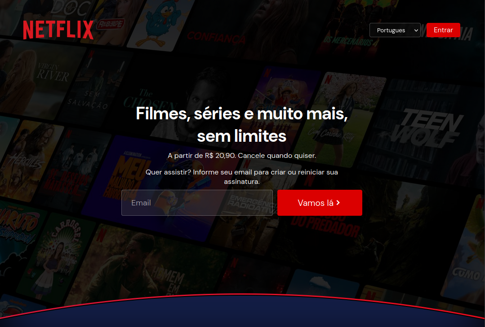

# Netflix Redesign 🎬



Projeto de recriação da interface da Netflix desenvolvido com foco em:

- UI/UX moderna
- Responsividade Mobile First
- HTML5 semântico
- CSS3 avançado
- Layout responsivo
- Efeitos visuais modernos
- Estrutura frontend limpa

---

## 📱 Preview

Interface inspirada na landing page oficial da Netflix, adaptada para diferentes tamanhos de tela.

### Recursos implementados

✅ Header responsivo  
✅ Hero section moderna  
✅ FAQ animado com `<details>`  
✅ Scroll horizontal de filmes  
✅ Blur effects  
✅ Gradientes modernos  
✅ Mobile First Design  
✅ Responsividade para tablets e desktop  
✅ Estrutura organizada em HTML + CSS puro

---

## 🚀 Tecnologias Utilizadas

- HTML5
- CSS3
- Flexbox
- Media Queries
- Boxicons
- Google Fonts

---

## 🎯 Objetivo do Projeto

Este projeto foi desenvolvido para praticar:

- Estruturação semântica
- Responsividade avançada
- Técnicas modernas de CSS
- Construção de landing pages
- Organização de componentes visuais
- UI Design inspirado em plataformas reais

---

## 📷 Layout

O projeto recria a experiência visual da Netflix utilizando apenas HTML e CSS, sem frameworks.

---

## 📱 Responsividade

O projeto foi desenvolvido utilizando abordagem **Mobile First**, adaptando a interface para:

- Smartphones
- Tablets
- Desktop

---

## 🛠️ Melhorias futuras

- [ ] Menu mobile interativo
- [ ] Dark mode avançado
- [ ] Carrossel funcional
- [ ] Animações suaves
- [ ] Versão com JavaScript
- [ ] Backend para autenticação

---

## 📂 Estrutura do Projeto

```bash
📦 netflix-redesign
 ┣ 📜 index.html
 ┣ 📜 styles.css
 ┣ 📜 preview.png
 ┣ 📂 assets
 ┃ ┣ 📷 banner.png
 ┃ ┣ 📷 logo.png
 ┃ ┗ 📷 ...
``

---

## 🔥 SEO Keywords

netflix redesign, netflix clone, netflix ui clone, responsive netflix landing page, html css netflix clone, frontend project, responsive ui design, netflix homepage redesign, mobile first website, css landing page

---

## 👨‍💻 Autor

Desenvolvido por João Manoel <a href="https://instagram.com/035.neto" target="_blank">  </a>
